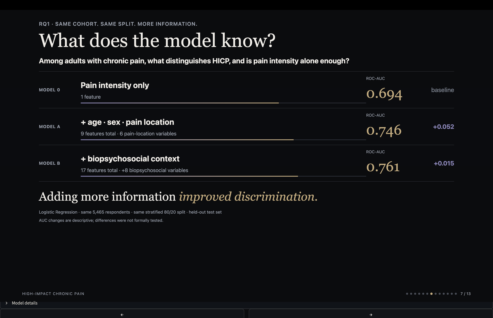
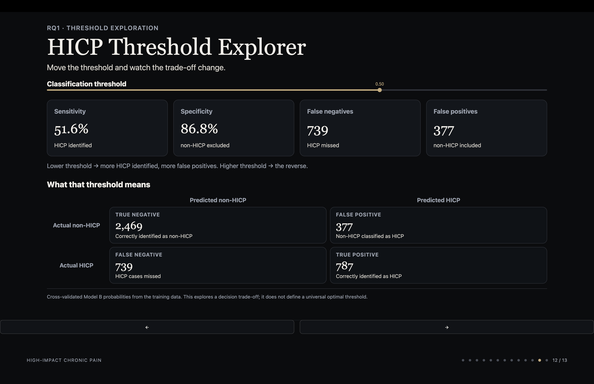
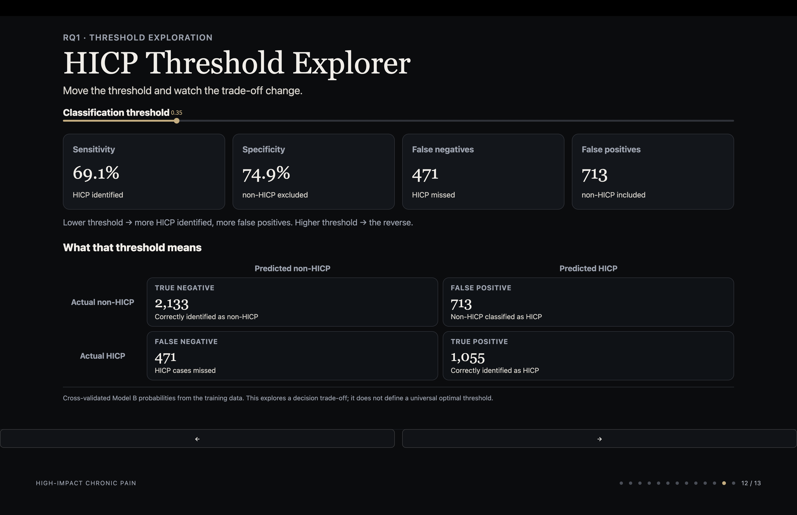

# High-Impact Chronic Pain
### Beyond pain intensity

Pain intensity tells us **how much pain someone reports**.  
It does not necessarily tell us **how much that pain is disrupting their life**.

Using the **2025 US National Health Interview Survey (NHIS)**, this project asks:

> **Among adults already living with chronic pain, is pain intensity alone enough to distinguish those whose pain substantially interferes with daily life or work?**

**Lara Caçador** · Ironhack Data Analytics Bootcamp · September 2026

`Python` · `pandas` · `scikit-learn` · `XGBoost` · `Streamlit`


---

## At a glance

| | |
|---|---:|
| Model-ready cohort | **5,465 adults with chronic pain** |
| Pain intensity only | **ROC-AUC 0.694** |
| Full Model B | **ROC-AUC 0.761** |
| Multimodal management | **65.4%** |
| Largest exercise-use gap | **25.1 percentage points by education** |

**Main finding:** richer information improved discrimination more than changing the algorithm.

<p align="center">
  
</p>

---

## Interactive presentation

The final presentation is implemented as an **interactive Streamlit app** in [`hicp_streamlit_app/`](hicp_streamlit_app/).

It includes the full presentation flow and an interactive **HICP threshold explorer** showing how sensitivity, specificity, false positives and false negatives change as the classification threshold moves.

<p align="center">
  
  
</p>

<p align="center">
  <em>Lowering the threshold from 0.50 to 0.35 identifies more HICP cases, at the cost of more false positives.</em>
</p>

Run it locally with:

```bash
cd hicp_streamlit_app
python -m streamlit run app.py
```


---

## Research questions

1. **RQ1 - HICP discrimination**  
   Among adults with chronic pain, what distinguishes those with high-impact chronic pain, and is pain intensity alone enough to distinguish them?

2. **RQ2 - Pain management**  
   What pain-management strategies are reported by adults with HICP?

3. **RQ3 - Socioeconomic and access differences**  
   Among adults with HICP, does reported use of pain-management strategies vary across socioeconomic and healthcare-access characteristics?

The full framing, hypotheses and predictor-selection rationale are in [`docs/business-case.md`](docs/business-case.md).  
Methodological notes on the population-level framing, transferability and threshold analysis are in [`docs/methodological-notes.md`](docs/methodological-notes.md).

---

## Key findings

### 1. Pain intensity mattered, but it did not tell the whole story

RQ1 compares three cumulative **Logistic Regression** models on the same model-ready cohort and train/test split.

| Model | Information available | ROC-AUC |
|---|---|---:|
| **Model 0** | Pain intensity only | **0.694** |
| **Model A** | Model 0 + age, sex and six pain-location variables | **0.746** |
| **Model B** | Model A + eight biopsychosocial variables | **0.761** |

The largest gain came from moving beyond pain intensity alone. The biopsychosocial layer then added a smaller further improvement.

The AUC differences are interpreted **descriptively**; they were not formally tested for statistical significance.

### 2. More complex algorithms did not improve overall discrimination

Keeping the **same 17 Model B predictors, respondents and train/test split**, I compared Logistic Regression with more flexible tree-based approaches:

| Algorithm | ROC-AUC |
|---|---:|
| **Logistic Regression** | **0.761** |
| Random Forest | 0.750 |
| Gradient Boosting | 0.758 |
| XGBoost | 0.719 |

In this untuned comparison, greater algorithmic complexity did not improve overall discrimination over Logistic Regression.

### 3. The threshold is a decision, not a property of the model

Model B had the best overall discrimination, but the conventional **0.50 threshold** favoured specificity over sensitivity.

Using **5-fold stratified cross-validated probabilities from the training set**, I explored thresholds from **0.30 to 0.60**.

Among the tested values, **0.35 produced the highest balanced accuracy (0.720)**:

- sensitivity: **0.691**
- specificity: **0.749**

This is **not** treated as a universally optimal threshold.

Lower thresholds identify more HICP cases, but they also increase false positives. The model can quantify that trade-off; it cannot decide which error matters more. That decision depends on the intended use, available resources and the consequences stakeholders are willing to accept.

### 4. Pain management was usually multimodal

Among adults with HICP:

- **77.7%** reported over-the-counter medication
- **53.5%** reported exercise
- prescribed pain relievers (**33.8%**), opioids (**33.0%**) and physical therapy (**31.8%**) were each reported by around one third

Among the **1,926 respondents with valid responses across the 10 clearly classifiable pharmacological/non-pharmacological strategies**, **65.4% reported using both types**.

These results describe reported use. They do not show which strategy works better or why a person chose it.

### 5. Exercise use differed across socioeconomic groups

Exercise was selected for closer RQ3 analysis using criteria defined before examining the results: sufficient subgroup size and meaningful variation across more than one socioeconomic or access characteristic.

The clearest differences were:

| Comparison | Reported exercise use | Gap |
|---|---:|---:|
| Less than high school vs bachelor's degree or higher | 39.3% vs 64.4% | **25.1 pp** |
| Lowest vs highest income-to-poverty group | 47.9% vs 62.3% | **14.4 pp** |

Cost-related access measures were less intuitive: respondents reporting cost barriers reported exercise somewhat more often, not less.

These are **cross-sectional descriptive patterns**. They show where differences appear, not why they exist.

---

## Analytical design

The modelling strategy separates two different questions.

### What information matters?

```text
Model 0
Pain intensity
    ↓
Model A
+ age + sex + pain location
    ↓
Model B
+ biopsychosocial context
```

The algorithm stays fixed as Logistic Regression while information is added.

### Does model flexibility matter?

```text
Logistic Regression B
        ↓
Random Forest
Gradient Boosting
XGBoost
```

The information stays fixed while the algorithm changes.

That separation makes the comparison interpretable: the first stage asks whether **richer information** helps; the second asks whether **greater model flexibility** helps.

---

## Data

Source: **2025 NHIS Sample Adult public-use file**

| Stage | n |
|---|---:|
| Original NHIS Sample Adult file | **24,215** |
| Chronic-pain analytical cohort with known limitation status | **5,592** |
| HICP within that cohort | **1,956** |
| RQ1 complete-case model-ready cohort | **5,465** |
| HICP in model-ready cohort | **1,908** |
| non-HICP in model-ready cohort | **3,557** |

**127 respondents** were excluded from RQ1 modelling because of missing predictor values.

In this project:

- **chronic pain** = pain experienced on most days or every day during the previous three months
- **high-impact chronic pain (HICP)** = chronic pain that also limited life or work activities on most days or every day

NHIS documentation is stored in [`references/`](references/), with the complete reference list in [`references/sources.md`](references/sources.md).

---

## Repository structure

```text
chronic-pain-impact/
├── data/
│   ├── raw/
│   └── processed/
├── docs/
│   ├── business-case.md
│   └── methodological-notes.md
├── figures/
├── hicp_streamlit_app/
├── notebooks/
│   ├── 01-data-audit.ipynb
│   ├── 02-data-preparation.ipynb
│   ├── 03-rq1-eda.ipynb
│   ├── 04-rq1-models.ipynb
│   ├── 05-pain-management.ipynb
│   └── 06-rq3-socioeconomic-access.ipynb
├── references/
├── src/
├── README.md
└── requirements.txt
```

### Notebook workflow

| Notebook | Purpose |
|---|---|
| `01-data-audit.ipynb` | Audit variables, missingness and predictor candidates |
| `02-data-preparation.ipynb` | Build the chronic-pain cohort and HICP outcome |
| `03-rq1-eda.ipynb` | Explore the model-ready cohort and RQ1 predictors |
| `04-rq1-models.ipynb` | Fit Models 0/A/B, compare algorithms and explore thresholds |
| `05-pain-management.ipynb` | Describe pain-management strategies and multimodal use |
| `06-rq3-socioeconomic-access.ipynb` | Compare strategy use across socioeconomic/access groups |

---

## Running the project locally

From the repository root:

```bash
pip install -r requirements.txt
```

Then run the notebooks in numerical order from `01` to `06`.

To run the presentation:

```bash
cd hicp_streamlit_app
python -m streamlit run app.py
```

---

## Limitations and interpretation boundaries

This project is cross-sectional and observational, so the results support
association and discrimination, not causal inference or prediction of who will
later develop HICP.

- **No causal or temporal conclusions.** The NHIS captures one point in time.
  Reported pain-management strategies cannot be interpreted as causes of better
  or worse outcomes, and socioeconomic/access differences show where patterns
  occur, not why they occur.

- **Self-reported survey data.** Pain, functional impact, management strategies
  and psychosocial characteristics are based on respondents' reports and may be
  affected by recall, interpretation and response differences.

- **Complete-case modelling.** RQ1 uses 5,465 of the 5,592 respondents in the
  analytical chronic-pain cohort; 127 were excluded because of missing predictor
  values. The HICP proportion remained almost unchanged, but complete-case
  analysis can still introduce selection effects.

- **Unweighted analytical results.** NHIS survey-design variables were retained,
  but the modelling and descriptive analyses here do not use survey weights.
  The reported percentages and model performance therefore describe the
  analytical sample and should not be interpreted as nationally weighted US
  estimates.

- **Model comparisons are descriptive.** The observed ROC-AUC values (0.694, 0.746 and 0.761) were compared descriptively; the differences were not formally tested for statistical uncertainty.

- **Internal rather than external validation.** Model performance was evaluated
  using one reproducible stratified train/test split, with cross-validation used
  for the threshold analysis. Performance has not been validated in an
  independent population.

- **Threshold analysis is exploratory.** The 0.30–0.60 range was defined
  after inspecting the distribution of cross-validated Model B probabilities.
  It includes the conventional 0.50 cutoff and focuses on a meaningful part of
  the probability distribution rather than extreme thresholds. The range was
  not selected or optimised by the model, and 0.35 should not be interpreted
  as a universally correct threshold. The appropriate trade-off depends on the
  intended use and the consequences of false positives and false negatives.

- **Limited predictor availability.** Model B can only use variables available
  in NHIS. Relevant constructs such as fear avoidance were not available, and
  some of the literature used to motivate biopsychosocial predictors concerns
  chronic musculoskeletal pain rather than HICP specifically.

- **Limited transportability.** The analytical framework may be transferable,
  but the fitted US model should not be assumed to generalise to other countries
  or healthcare systems without external validation and potentially
  recalibration.

The model is intended for population-level analysis and service-planning
questions. It is not a diagnostic tool and does not determine individual
treatment or resource allocation.

---

## Disclaimer

The analyses, interpretations and conclusions in this project are the author's own.

The National Center for Health Statistics is responsible only for the initial NHIS data.
